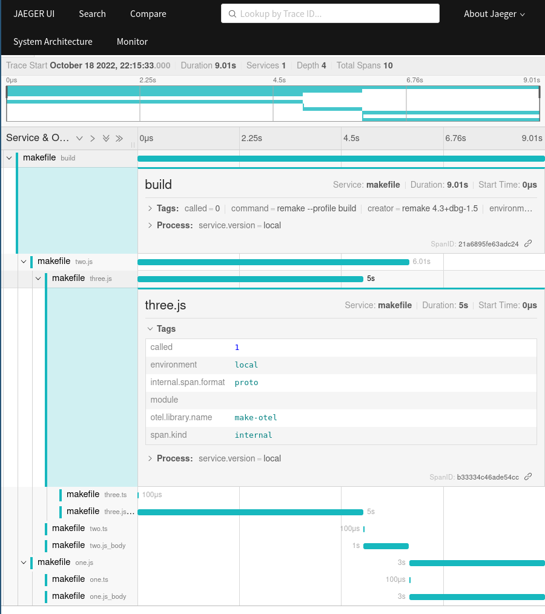

# make-otel

*Turns a [Remake] profile into an otel trace*

## Usage

```shell
makeotel ./example/callgrind.out.build-3
```



You can parent the spans to an existing trace with either the `--trace-parent` flag, or `TRACEPARENT` environment variable.

By default, it will send to an OTEL collector running on `localhost:4317`.  This can be configured (see table below)

## Configuration

| Name | Flag | EnvVar | Default | Description |
|------|------|--------|---------|-------------|
| Timestamp | `--timestamp` | none | `time.Now().UTC().Unix()` | The profile was started |
| Trace Parent | `--trace-parent` | `TRACEPARENT` | empty | A trace to attach these spans to |
| OTLP Debug | `--otlp-debug` | `OTEL_DEBUG` | `false` | Log to `stdout` information from the OTLP Exporter |
| OTLP Endpoint | `--otlp-endpoint` | `OTEL_EXPORTER_OTLP_ENDPOINT` `OTEL_EXPORTER_OTLP_TRACES_ENDPOINT` | `localhost:4317` | The OTEL endpoint to send spans to |
| OTLP Headers | `--otlp-headers` | none | empty | Add custom headers to the OTEL Exporter, useful for SaaS Auth |


## Development

There is a `docker-compose.yml` to run an OTEL Collector and a Jaeger instance for local testing.

## Todo

- [ ] Github Actions build, release creation
- [ ] environment variable for `--otlp-headers`
- [ ] configuration file?
- [ ] custom TLS certificates for exporter?

[remake]: https://remake.readthedocs.io/en/latest/
